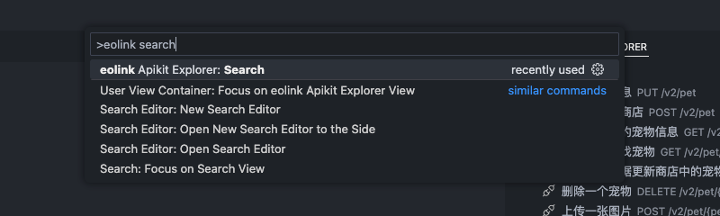

# eolink Apikit Explorer

## 功能

在 VS Code 中就能够直接浏览 eolink Apikit 中的 Open API 定义，最重要的是，他还能够自动为你生成 API 的 TypeScript 类型声明文件！

### 亮点

- 无缝集成：该插件将 eolink Apikit 的接口无缝集成到 VS Code，直接在 VS Code 中就能查看接口声明
- 快速搜索：使用接口名称或者接口地址进行模糊搜索，快速定位接口声明
- 代码生成：点击接口名称就能够自动生成其相关的 TypeScript 接口代码
- 一键复制：通过 Codelens 功能，你可以在编辑窗口中一键复制接口声明

### 插件设置

安装完成后，第一步需要对插件进行配置，以便能够获取到 API 列表信息。

通过资源管理器界面查看接口管理面板，或者，通过 <kbd>Ctrl</kbd> + <kbd>Shift</kbd> + <kbd>P</kbd> 或 <kbd>Command</kbd> + <kbd>Shift</kbd> + <kbd>P</kbd> 快捷键打开命令面板，输入 `eolink view` 关键字找到并执行 `用户视图容器: 焦点在 eolink Apikit Explorer 视图上` 命令来打开。

点击 `添加 Open API` 或者点击设置图标来开始设置插件。

插件主要需要两个关键配置项，eolink API URL 和 eolink 个人访问令牌。

#### 获取 eolink API URL

eolink API URL 是用来告诉插件从哪里获取到 API 的配置文件，以便插件能够展示，由于存在私有化部署的情况，API URL 可能会有所不同。API URL 的获取方式可能会有点复杂，所以获取方式仅供参考，以官方示例为例。

在 eolink 接口管理界面中（注意不是插件这里），使用 <kbd>F12</kbd> 或 <kbd>Alt</kbd> + <kbd>Command</kbd> + <kbd>I</kbd> 打开开发者工具。

在网络面板下搜索 `apiManagementPro` 路径下的接口，点击符合 `apiManagementPro` 路径下的任意接口查看其请求地址，其前缀即为 eolink API URL，也就是图中红底标亮的部分 `https://apis.eolink.com/api`。

> 注意：图中的 API URL 仅为示例，实际配置需要以各自所部署 eolink 地址为准

#### 生成 eolink 个人访问令牌

在获取到 eolink API URL 后，插件还需要 eolink 的个人访问令牌才能够正常获取接口列表信息，接下来我们为插件生成一个令牌。

点击 eolink 接口管理界面的右上角用户头像进入个人中心。

在个人中心点击令牌管理菜单，打开令牌管理界面。

点击 「创建个人访问令牌」 按钮打开令牌创建窗口。

在令牌创建表单如输入应用名称（这里可以设置为 `VS Code eolinker Plugin`），并根据个人需要，设置令牌的有效期，最后点击确定来生成令牌。

创建成功后会弹出创建令牌成功的弹窗，弹窗包含了我们创建完成的令牌，注意，要及时保存该令牌信息，因为关闭弹窗后就无法再获取到了。不过不用担心，如果还没保存令牌就不小心关闭了弹窗，可以再重新创建即可。

#### 完成配置

在准备好 eolink API URL 和 eolink 个人访问令牌后，就可以开始配置插件了，通过命令面板输入 `eolink setup` 关键字找到并执行 `eolink Apikit Explorer: 设置` 命令来进行设置，根据提示信息填入相关信息。

### 功能说明

#### 接口列表展示

在设置完插件以后就能够看到接口列表了，接口管理面板一次只能展示一个工作空间下的一个项目的接口列表，如果要切换接口列表需要重新设置插件，不过放心，在第一次设置完成后，后续的设置都会自动回显之前的配置信息，所以一般情况下只需要切换一下工作空间或者项目就行了。

可以看到，在接口管理面板中展示了接口分组名称，接口名称，接口 HTTP 方法和接口地址等信息。

#### 搜索功能

随着接口数量变多，从接口面板中查找相关接口就会变得越来越困难。这时候，我们就可以使用接口搜索功能来查找我们需要的接口信息。

想要使用搜索功能，可以通过 API 管理面板的搜索按钮，或者，通过命令面板输入 `eolink search` 关键字找到并执行 `eolink Apikit Explorer: 搜索` 命令来搜索。

只要是接口管理面板中能看到的接口信息都可以通过搜索功能进行检索，搜索功能支持模糊搜索，例如我们想要查找添加宠物的接口，就可以使用 `post pet` 关键字来缩小查找范围。

如果我们知道接口的大致名称的话，也可以直接输入接口名称，需要注意的是，汉字不支持模糊搜索。

#### TypeScript 接口生成

可以点击接口管理面板或者搜索结果中的接口来自动生成接口相关信息的 TypeScript 接口代码，接口代码包括各种请求参数以及响应结果，还能够一键复制代码块。

